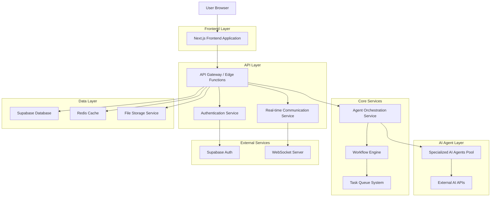
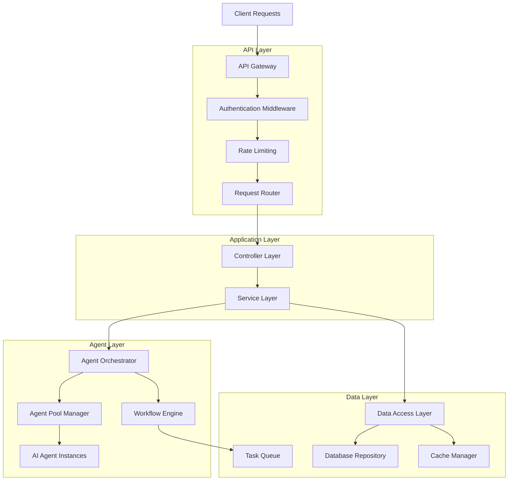
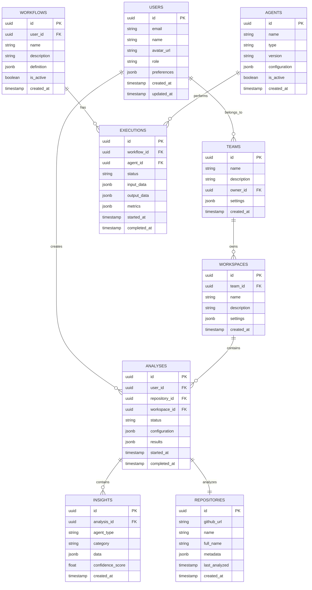

# ChimeraGPT - Technical Architecture Upgrade

## 1. Architecture Design



## 2. Technology Description

- Frontend: Next.js@15 + React@19 + TypeScript + TailwindCSS + Framer Motion
- Backend: Next.js API Routes + Supabase Edge Functions
- Database: Supabase (PostgreSQL) + Redis for caching
- Authentication: Supabase Auth + GitHub OAuth
- AI Framework: Google Genkit + Custom Agent Framework
- Real-time: Supabase Realtime + WebSockets
- File Storage: Supabase Storage
- Monitoring: Sentry + Custom Analytics
- Deployment: Vercel + Supabase Cloud

## 3. Route Definitions

| Route | Purpose |
|-------|---------|
| / | Landing page with authentication and quick repository input |
| /dashboard | Main dashboard with user workspace and recent analyses |
| /repository/[id] | Detailed repository analysis with multi-agent insights |
| /orchestrator | Agent workflow designer and execution monitor |
| /analytics | Analytics hub with reports and trend analysis |
| /workspace/[teamId] | Team collaboration workspace |
| /settings | User preferences and configuration |
| /admin | Enterprise administration panel |
| /api/auth/* | Authentication endpoints |
| /api/agents/* | Agent management and execution APIs |
| /api/repositories/* | Repository analysis and data APIs |
| /api/workflows/* | Workflow management APIs |
| /api/analytics/* | Analytics and reporting APIs |

## 4. API Definitions

### 4.1 Core API

**Agent Orchestration**
```
POST /api/agents/execute
```

Request:
| Param Name | Param Type | isRequired | Description |
|------------|------------|------------|-------------|
| agentType | string | true | Type of agent to execute (repo-analyzer, security-auditor, etc.) |
| input | object | true | Input data for the agent |
| workflowId | string | false | Optional workflow ID for chained execution |
| priority | number | false | Execution priority (1-10) |

Response:
| Param Name | Param Type | Description |
|------------|------------|-------------|
| executionId | string | Unique execution identifier |
| status | string | Execution status (queued, running, completed, failed) |
| result | object | Agent execution result |
| metrics | object | Performance metrics |

**Repository Analysis**
```
POST /api/repositories/analyze
```

Request:
| Param Name | Param Type | isRequired | Description |
|------------|------------|------------|-------------|
| repositoryUrl | string | true | GitHub repository URL |
| analysisType | string[] | false | Types of analysis to perform |
| teamId | string | false | Team workspace ID |

Response:
| Param Name | Param Type | Description |
|------------|------------|-------------|
| analysisId | string | Unique analysis identifier |
| repository | object | Repository metadata |
| insights | object[] | Analysis results from multiple agents |
| visualizations | object | Data for charts and graphs |

**Workflow Management**
```
POST /api/workflows/create
```

Request:
| Param Name | Param Type | isRequired | Description |
|------------|------------|------------|-------------|
| name | string | true | Workflow name |
| description | string | false | Workflow description |
| steps | object[] | true | Array of workflow steps |
| triggers | object[] | false | Workflow triggers |

Response:
| Param Name | Param Type | Description |
|------------|------------|-------------|
| workflowId | string | Unique workflow identifier |
| status | string | Workflow status |
| createdAt | string | Creation timestamp |

## 5. Server Architecture Diagram



## 6. Data Model

### 6.1 Data Model Definition



### 6.2 Data Definition Language

**Users Table**
```sql
-- Create users table
CREATE TABLE users (
    id UUID PRIMARY KEY DEFAULT gen_random_uuid(),
    email VARCHAR(255) UNIQUE NOT NULL,
    name VARCHAR(100) NOT NULL,
    avatar_url TEXT,
    role VARCHAR(20) DEFAULT 'developer' CHECK (role IN ('guest', 'developer', 'team_lead', 'admin')),
    preferences JSONB DEFAULT '{}',
    created_at TIMESTAMP WITH TIME ZONE DEFAULT NOW(),
    updated_at TIMESTAMP WITH TIME ZONE DEFAULT NOW()
);

-- Create teams table
CREATE TABLE teams (
    id UUID PRIMARY KEY DEFAULT gen_random_uuid(),
    name VARCHAR(100) NOT NULL,
    description TEXT,
    owner_id UUID REFERENCES users(id) ON DELETE CASCADE,
    settings JSONB DEFAULT '{}',
    created_at TIMESTAMP WITH TIME ZONE DEFAULT NOW()
);

-- Create repositories table
CREATE TABLE repositories (
    id UUID PRIMARY KEY DEFAULT gen_random_uuid(),
    github_url TEXT UNIQUE NOT NULL,
    name VARCHAR(255) NOT NULL,
    full_name VARCHAR(255) NOT NULL,
    metadata JSONB DEFAULT '{}',
    last_analyzed TIMESTAMP WITH TIME ZONE,
    created_at TIMESTAMP WITH TIME ZONE DEFAULT NOW()
);

-- Create analyses table
CREATE TABLE analyses (
    id UUID PRIMARY KEY DEFAULT gen_random_uuid(),
    user_id UUID REFERENCES users(id) ON DELETE CASCADE,
    repository_id UUID REFERENCES repositories(id) ON DELETE CASCADE,
    workspace_id UUID,
    status VARCHAR(20) DEFAULT 'pending' CHECK (status IN ('pending', 'running', 'completed', 'failed')),
    configuration JSONB DEFAULT '{}',
    results JSONB DEFAULT '{}',
    started_at TIMESTAMP WITH TIME ZONE DEFAULT NOW(),
    completed_at TIMESTAMP WITH TIME ZONE
);

-- Create insights table
CREATE TABLE insights (
    id UUID PRIMARY KEY DEFAULT gen_random_uuid(),
    analysis_id UUID REFERENCES analyses(id) ON DELETE CASCADE,
    agent_type VARCHAR(50) NOT NULL,
    category VARCHAR(50) NOT NULL,
    data JSONB NOT NULL,
    confidence_score FLOAT CHECK (confidence_score >= 0 AND confidence_score <= 1),
    created_at TIMESTAMP WITH TIME ZONE DEFAULT NOW()
);

-- Create workflows table
CREATE TABLE workflows (
    id UUID PRIMARY KEY DEFAULT gen_random_uuid(),
    user_id UUID REFERENCES users(id) ON DELETE CASCADE,
    name VARCHAR(100) NOT NULL,
    description TEXT,
    definition JSONB NOT NULL,
    is_active BOOLEAN DEFAULT true,
    created_at TIMESTAMP WITH TIME ZONE DEFAULT NOW()
);

-- Create agents table
CREATE TABLE agents (
    id UUID PRIMARY KEY DEFAULT gen_random_uuid(),
    name VARCHAR(100) NOT NULL,
    type VARCHAR(50) NOT NULL,
    version VARCHAR(20) DEFAULT '1.0.0',
    configuration JSONB DEFAULT '{}',
    is_active BOOLEAN DEFAULT true,
    created_at TIMESTAMP WITH TIME ZONE DEFAULT NOW()
);

-- Create executions table
CREATE TABLE executions (
    id UUID PRIMARY KEY DEFAULT gen_random_uuid(),
    workflow_id UUID REFERENCES workflows(id) ON DELETE CASCADE,
    agent_id UUID REFERENCES agents(id) ON DELETE CASCADE,
    status VARCHAR(20) DEFAULT 'queued' CHECK (status IN ('queued', 'running', 'completed', 'failed')),
    input_data JSONB,
    output_data JSONB,
    metrics JSONB DEFAULT '{}',
    started_at TIMESTAMP WITH TIME ZONE DEFAULT NOW(),
    completed_at TIMESTAMP WITH TIME ZONE
);

-- Create workspaces table
CREATE TABLE workspaces (
    id UUID PRIMARY KEY DEFAULT gen_random_uuid(),
    team_id UUID REFERENCES teams(id) ON DELETE CASCADE,
    name VARCHAR(100) NOT NULL,
    description TEXT,
    settings JSONB DEFAULT '{}',
    created_at TIMESTAMP WITH TIME ZONE DEFAULT NOW()
);

-- Create indexes for performance
CREATE INDEX idx_analyses_user_id ON analyses(user_id);
CREATE INDEX idx_analyses_repository_id ON analyses(repository_id);
CREATE INDEX idx_analyses_status ON analyses(status);
CREATE INDEX idx_insights_analysis_id ON insights(analysis_id);
CREATE INDEX idx_insights_agent_type ON insights(agent_type);
CREATE INDEX idx_executions_workflow_id ON executions(workflow_id);
CREATE INDEX idx_executions_status ON executions(status);
CREATE INDEX idx_repositories_github_url ON repositories(github_url);

-- Row Level Security policies
ALTER TABLE users ENABLE ROW LEVEL SECURITY;
ALTER TABLE analyses ENABLE ROW LEVEL SECURITY;
ALTER TABLE insights ENABLE ROW LEVEL SECURITY;
ALTER TABLE workflows ENABLE ROW LEVEL SECURITY;
ALTER TABLE executions ENABLE ROW LEVEL SECURITY;

-- Grant permissions
GRANT SELECT ON users TO anon;
GRANT ALL PRIVILEGES ON users TO authenticated;
GRANT ALL PRIVILEGES ON analyses TO authenticated;
GRANT ALL PRIVILEGES ON insights TO authenticated;
GRANT ALL PRIVILEGES ON workflows TO authenticated;
GRANT ALL PRIVILEGES ON executions TO authenticated;
GRANT SELECT ON repositories TO anon;
GRANT ALL PRIVILEGES ON repositories TO authenticated;

-- Insert initial agent configurations
INSERT INTO agents (name, type, configuration) VALUES
('Repository Analyzer', 'repo-analyzer', '{"model": "gemini-1.5-flash-latest", "timeout": 300}'),
('Security Auditor', 'security-auditor', '{"model": "gemini-1.5-flash-latest", "severity_threshold": "medium"}'),
('Architecture Reviewer', 'architecture-reviewer', '{"model": "gemini-1.5-flash-latest", "focus_areas": ["scalability", "maintainability"]}'),
('Code Quality Analyzer', 'code-quality', '{"model": "gemini-1.5-flash-latest", "metrics": ["complexity", "duplication", "coverage"]}'),
('Dependency Auditor', 'dependency-auditor', '{"model": "gemini-1.5-flash-latest", "check_vulnerabilities": true}');
```
